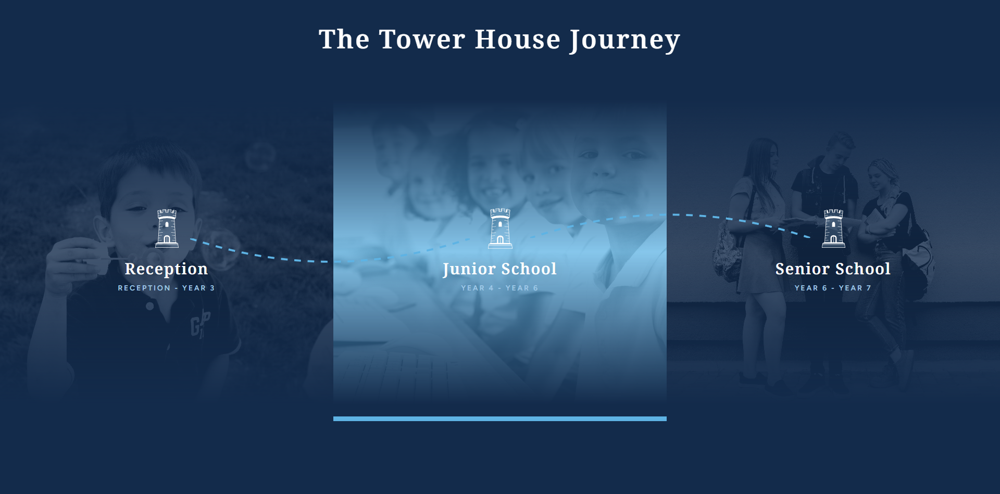
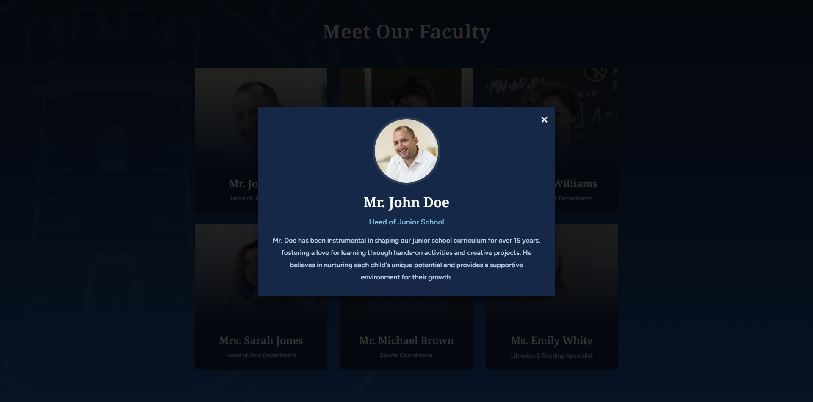

# Frontend Technical Assessment - Joao Saavedra

## Overview

This repository showcases the solutions to a two-part frontend technical assessment. The primary goal was to demonstrate proficiency in modern web development using **HTML, CSS, and JavaScript (Vanilla JS)**, focusing on replicating design specifications, building interactive components, and applying best practices in code organization and accessibility.

Each task is contained within its own dedicated folder for clear separation and modularity.

---

## Task 1: The Tower House Journey Section

### Description

This task involved accurately replicating a specific section from an Adobe XD design file. The "Tower House Journey" section visually represents different stages of a school journey, featuring dynamic image effects, custom SVG paths, and intricate CSS layering.

### Screenshot

**Desktop View:**

### Key Features Implemented

- **HTML Structure:**
  - Semantic HTML (`<section>`, `div`, `h1`, `h2`, `p`, `img`, `svg`).
  - Clear and consistent class naming conventions (`journey-section`, `journey-stage`, `stage-content`, etc.).
- **CSS Styling & Layout:**
  - **Flexbox:** Used for arranging the journey stages horizontally, ensuring responsive distribution.
  - **Custom Fonts:** Implemented `NotoSerif-SemiBold` and `FigTree-SemiBold` via `@font-face` rules, ensuring correct font rendering and weights.
  - **Consistent Design Language:** Replicated the exact color palette (defined using CSS Variables for maintainability) and typography styles from the original design.
  - **Layered Backgrounds & Effects:**
    - `::before` / `::after` pseudo-elements for image overlays and gradients.
    - `filter: grayscale(1)` for monochrome image effect.
    - `linear-gradient` for specific blue tint overlay that fades at top/bottom.
    - `mask-image`: Used to create an opacity gradient mask on images for a seamless blend with the background.
  - **Complex Animations & Transitions:**
    - Smooth hover effects on journey stage cards (image scale, overlay color change, icon scale).
    - Dynamic bar (animated `::after` pseudo-element) on hover.
    - Transitions applied efficiently to base elements, not just `:hover` states, for smooth in/out animations.
  - **SVG Integration:**
    - Inline `<svg>` elements used for the dotted connecting lines.
    - Custom SVG `path` data defined with `viewBox` for precise rendering.
    - SVG lines are positioned absolutely (`position: absolute`) and clipped (`overflow: hidden`) to prevent interference with main layout.

---

## Task 2: Meet Our Faculty Section

### Description

This task was a freestyle opportunity to develop a custom section that could integrate seamlessly into a school website. I chose to build an interactive "Meet Our Faculty" section featuring dynamic profile cards and a detailed modal view, designed to match the visual style of the first exercise.

### Screenshots

**Desktop View:**

**Modal Open View:**

### Key Features Implemented

- **HTML Structure:**
  - Clean and semantic HTML for faculty cards (`div` with `role="button"`, `h3`, `p`).
  - Clear separation of main content and modal overlay.
- **CSS Styling & Layout:**
  - **Consistent Design Language:** Successfully matched the color palette, typography (using CSS variables for fonts), and hover effects from the first exercise.
  - **CSS Grid:** Utilized `display: grid` with `repeat(auto-fit, minmax(...))` for a highly responsive and flexible faculty card gallery.
  - **Image Effects:** Replicated the `grayscale` filter and `linear-gradient` overlay with top/bottom fade for faculty profile images, ensuring visual continuity.
  - **Complex Background:** Implemented a large, subtly positioned `school-logo.svg` as a background pattern for the entire section.
  - **Modal Styling:** Designed a full-screen modal overlay with a central content box, custom close button, and smooth transitions for opening and closing.
- **JavaScript Interactivity (Vanilla JS):**
  - **Dynamic DOM Generation:** All faculty cards are dynamically created and appended to the DOM using data from a JavaScript array, demonstrating efficient content management.
  - **Event Handling:** Implemented `click` listeners for opening/closing the modal and a `keydown` listener for `Escape` key to close the modal.
  - **DOM Manipulation:** Dynamically populating modal content based on the clicked faculty member's data.
  - **Smooth Transitions:** JavaScript class toggling (`.is-open`) works in conjunction with CSS `transition` properties for a polished user experience.
- **Accessibility (A11y) - Key Highlight:**
  - **ARIA Roles & States:**
    - `role="button"` and `tabindex="0"` on faculty cards to make them keyboard focusable and semantically interactive.
    - `aria-haspopup="dialog"` on faculty cards to inform screen reader users that activating them will open a dialog.
    - `role="dialog"` and `aria-modal="true"` on the modal overlay to clearly define its purpose and ensure assistive technologies treat it as a true modal, preventing interaction with background content.
    - `aria-label="Close modal"` for the icon-only close button.
    - `aria-labelledby` on the modal to link its title as its accessible label, providing context for screen readers.
    - `aria-hidden="true"` applied to the rest of the page content when the modal is open, making background content inert for screen readers.
  - **Focus Management:**
    - Initial focus is set to the modal's close button upon opening.
    - Implemented **Focus Trapping** within the modal using a `keydown` listener for `Tab` and `Shift+Tab` to ensure keyboard users cannot tab out of the modal.
    - Focus is returned to the original clicked faculty card upon modal closure, improving user flow for keyboard users.
  - **Keyboard Navigation:** Faculty cards can be activated with `Enter` or `Space` keys. The modal can be closed with `Escape`.
  - **Background Scroll Lock:** `document.body.style.overflow = 'hidden'` prevents background page scrolling when the modal is active.
